# Architecture

The system has 36 units; entry point(s): MENU, __MAIN__, TEST_PIPELINE. 152 call/import edges and 2 data stores were recovered. Layering below is inferred from fan-in and entry points.

## Component and data-store graph

```mermaid
graph TD
  CONTA[CONTA]
  EXTRATO[EXTRATO]
  MENU([MENU])
  UTIL[UTIL]
  KBDREAD[KBDREAD]
  __INIT__[__INIT__]
  __MAIN__([__MAIN__])
  ANALYSIS[ANALYSIS]
  CLI[CLI]
  CONFIDENCE[CONFIDENCE]
  ENGINES[ENGINES]
  INSTALLER[INSTALLER]
  MANIFEST[MANIFEST]
  MODELS[MODELS]
  ORCHESTRATOR[ORCHESTRATOR]
  PROJECT[PROJECT]
  __INIT__[__INIT__]
  ARCHAEOLOGIST[ARCHAEOLOGIST]
  ARCHITECT[ARCHITECT]
  BASE[BASE]
  DETECTIVE[DETECTIVE]
  MIGRATION[MIGRATION]
  PROCESS[PROCESS]
  REVIEWER[REVIEWER]
  SCOUT[SCOUT]
  WRITER[WRITER]
  __INIT__[__INIT__]
  ANTHROPIC_BACKEND[ANTHROPIC_BACKEND]
  BASE[BASE]
  HEURISTIC[HEURISTIC]
  CONFTEST[CONFTEST]
  TEST_ANALYSIS[TEST_ANALYSIS]
  TEST_BACKEND[TEST_BACKEND]
  TEST_CONFIDENCE[TEST_CONFIDENCE]
  TEST_MANIFEST[TEST_MANIFEST]
  TEST_PIPELINE([TEST_PIPELINE])
  ANALYSIS --> DATACLASSES
  ANALYSIS --> RE
  ANALYSIS --> __FUTURE__
  ANTHROPIC_BACKEND --> .BASE
  ANTHROPIC_BACKEND --> JSON
  ANTHROPIC_BACKEND --> OS
  ANTHROPIC_BACKEND --> TIME
  ANTHROPIC_BACKEND --> TYPING
  ANTHROPIC_BACKEND --> URLLIB
  ANTHROPIC_BACKEND --> __FUTURE__
  ARCHAEOLOGIST --> .
  ARCHAEOLOGIST --> .BASE
  ARCHAEOLOGIST --> TYPING
  ARCHAEOLOGIST --> __FUTURE__
  ARCHITECT --> .
  ARCHITECT --> .BASE
  ARCHITECT --> COLLECTIONS
  ARCHITECT --> RE
  ARCHITECT --> TYPING
  ARCHITECT --> __FUTURE__
  BASE --> .
  BASE --> .ANTHROPIC_BACKEND
  BASE --> .HEURISTIC
  BASE --> ABC
  BASE --> DATACLASSES
  BASE --> JSON
  BASE --> OS
  BASE --> PATHLIB
  BASE --> RE
  BASE --> TYPING
  BASE --> __FUTURE__
  CLI --> .
  CLI --> .CONFIDENCE
  CLI --> .LLM
  CLI --> .MODELS
  CLI --> .ORCHESTRATOR
  CLI --> ARGPARSE
  CLI --> JSON
  CLI --> PATHLIB
  CLI --> SYS
  CLI --> __FUTURE__
  CONFIDENCE --> .MODELS
  CONFIDENCE --> COLLECTIONS
  CONFIDENCE --> DATACLASSES
  CONFIDENCE --> PATHLIB
  CONFIDENCE --> __FUTURE__
  CONFTEST --> PATHLIB
  CONFTEST --> PYTEST
  CONFTEST --> SHUTIL
  CONTA --> UTIL
  DETECTIVE --> .
  DETECTIVE --> .BASE
  DETECTIVE --> RE
  DETECTIVE --> TYPING
  DETECTIVE --> __FUTURE__
  ENGINES --> DATACLASSES
  ENGINES --> PATHLIB
  ENGINES --> __FUTURE__
  EXTRATO --> UTIL
  HEURISTIC --> .BASE
  HEURISTIC --> TYPING
  HEURISTIC --> __FUTURE__
  INSTALLER --> .
  INSTALLER --> .AGENTS
  INSTALLER --> .ENGINES
  INSTALLER --> .MANIFEST
  INSTALLER --> .ORCHESTRATOR
  INSTALLER --> JSON
  INSTALLER --> PATHLIB
  INSTALLER --> SHUTIL
  INSTALLER --> TIME
  INSTALLER --> __FUTURE__
  KBDREAD --> STDIO
  KBDREAD --> TERMIOS
  KBDREAD --> UNISTD
  MANIFEST --> DATACLASSES
  MANIFEST --> HASHLIB
  MANIFEST --> JSON
  MANIFEST --> PATHLIB
  MANIFEST --> TYPING
  MANIFEST --> __FUTURE__
  MENU --> CONTA
  MENU --> EXTRATO
  MENU --> KBDREAD
  MIGRATION --> .
  MIGRATION --> .BASE
  MIGRATION --> RE
  MIGRATION --> TYPING
  MIGRATION --> __FUTURE__
  MODELS --> DATACLASSES
  MODELS --> ENUM
  MODELS --> JSON
  MODELS --> PATHLIB
  MODELS --> RE
  MODELS --> TYPING
  MODELS --> __FUTURE__
  ORCHESTRATOR --> .AGENTS
  ORCHESTRATOR --> .CONFIDENCE
  ORCHESTRATOR --> .LLM
  ORCHESTRATOR --> .MODELS
  ORCHESTRATOR --> .PROJECT
  ORCHESTRATOR --> DATACLASSES
  ORCHESTRATOR --> JSON
  ORCHESTRATOR --> PATHLIB
  ORCHESTRATOR --> TIME
  ORCHESTRATOR --> TRACEBACK
  ORCHESTRATOR --> TYPING
  ORCHESTRATOR --> __FUTURE__
  PROCESS --> .
  PROCESS --> .BASE
  PROCESS --> RE
  PROCESS --> TYPING
  PROCESS --> __FUTURE__
  PROJECT --> .MODELS
  PROJECT --> OS
  PROJECT --> PATHLIB
  PROJECT --> __FUTURE__
  REVIEWER --> .
  REVIEWER --> .BASE
  REVIEWER --> TYPING
  REVIEWER --> __FUTURE__
  SCOUT --> .
  SCOUT --> .BASE
  SCOUT --> COLLECTIONS
  SCOUT --> TYPING
  SCOUT --> __FUTURE__
  TEST_ANALYSIS --> PATHLIB
  TEST_ANALYSIS --> REVERSA
  TEST_BACKEND --> JSON
  TEST_BACKEND --> REVERSA
  TEST_CONFIDENCE --> REVERSA
  TEST_MANIFEST --> PATHLIB
  TEST_MANIFEST --> REVERSA
  TEST_PIPELINE --> JSON
  TEST_PIPELINE --> PATHLIB
  TEST_PIPELINE --> PYTEST
  TEST_PIPELINE --> REVERSA
  WRITER --> .
  WRITER --> .BASE
  WRITER --> COLLECTIONS
  WRITER --> TYPING
  WRITER --> __FUTURE__
  __INIT__ --> .ARCHAEOLOGIST
  __INIT__ --> .ARCHITECT
  __INIT__ --> .BASE
  __INIT__ --> .DETECTIVE
  __INIT__ --> .MIGRATION
  __INIT__ --> .PROCESS
  __INIT__ --> .REVIEWER
  __INIT__ --> .SCOUT
  __INIT__ --> .WRITER
  __MAIN__ --> .CLI
  DS_CLIENTES[(CLIENTES)]
  CONTA -.-> DS_CLIENTES
  MENU -.-> DS_CLIENTES
  DS_MOVTOS[(MOVTOS)]
  CONTA -.-> DS_MOVTOS
  EXTRATO -.-> DS_MOVTOS
```

## Layers (inferred)

- **Entry / UI**: MENU, __MAIN__, TEST_PIPELINE
- **Shared services**: UTIL
- **Domain modules**: CONTA, EXTRATO, KBDREAD, __INIT__, ANALYSIS, CLI, CONFIDENCE, ENGINES, INSTALLER, MANIFEST, MODELS, ORCHESTRATOR, PROJECT, __INIT__, ARCHAEOLOGIST, ARCHITECT, BASE, DETECTIVE, MIGRATION, PROCESS, REVIEWER, SCOUT, WRITER, __INIT__, ANTHROPIC_BACKEND, BASE, HEURISTIC, CONFTEST, TEST_ANALYSIS, TEST_BACKEND, TEST_CONFIDENCE, TEST_MANIFEST

## Main flows

- **Fan-out from MENU (call targets, not a sequence)**: CONTA → EXTRATO → KBDREAD
- **Fan-out from __MAIN__ (call targets, not a sequence)**: .CLI
- **Fan-out from TEST_PIPELINE (call targets, not a sequence)**: JSON → PATHLIB → PYTEST → REVERSA

## Architecture claims

- 🟡 **C-479** DATACLASSES is a shared utility: 7 units depend on it, so changes to it have system-wide impact.
- 🟡 **C-480** RE is a shared utility: 7 units depend on it, so changes to it have system-wide impact.
- 🟡 **C-481** __FUTURE__ is a shared utility: 20 units depend on it, so changes to it have system-wide impact.
- 🟡 **C-482** .BASE is a shared utility: 11 units depend on it, so changes to it have system-wide impact.
- 🟡 **C-483** JSON is a shared utility: 9 units depend on it, so changes to it have system-wide impact.
- 🟡 **C-484** OS is a shared utility: 3 units depend on it, so changes to it have system-wide impact.
- 🟡 **C-485** TIME is a shared utility: 3 units depend on it, so changes to it have system-wide impact.
- 🟡 **C-486** TYPING is a shared utility: 14 units depend on it, so changes to it have system-wide impact.
- 🟡 **C-487** . is a shared utility: 11 units depend on it, so changes to it have system-wide impact.
- 🟡 **C-488** COLLECTIONS is a shared utility: 4 units depend on it, so changes to it have system-wide impact.
- 🟡 **C-489** PATHLIB is a shared utility: 13 units depend on it, so changes to it have system-wide impact.
- 🟡 **C-490** .CONFIDENCE is a shared utility: 2 units depend on it, so changes to it have system-wide impact.
- 🟡 **C-491** .LLM is a shared utility: 2 units depend on it, so changes to it have system-wide impact.
- 🟡 **C-492** .MODELS is a shared utility: 4 units depend on it, so changes to it have system-wide impact.
- 🟡 **C-493** .ORCHESTRATOR is a shared utility: 2 units depend on it, so changes to it have system-wide impact.
- 🟡 **C-494** PYTEST is a shared utility: 2 units depend on it, so changes to it have system-wide impact.
- 🟡 **C-495** SHUTIL is a shared utility: 2 units depend on it, so changes to it have system-wide impact.
- 🟡 **C-496** UTIL is a shared utility: 2 units depend on it, so changes to it have system-wide impact.
- 🟡 **C-497** .AGENTS is a shared utility: 2 units depend on it, so changes to it have system-wide impact.
- 🟡 **C-498** REVERSA is a shared utility: 5 units depend on it, so changes to it have system-wide impact.
- 🟡 **C-499** Data store 'CLIENTES' is shared by CONTA, MENU; they are coupled through the file layout, not through calls.
- 🟡 **C-500** Data store 'MOVTOS' is shared by CONTA, EXTRATO; they are coupled through the file layout, not through calls.
