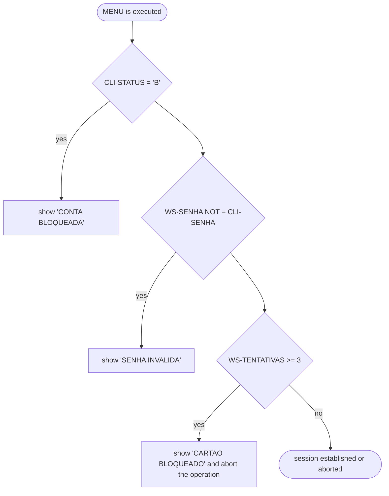
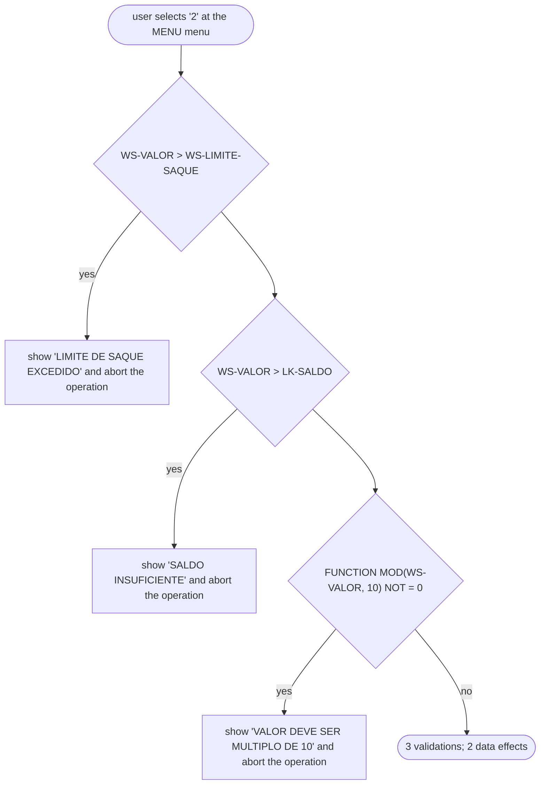
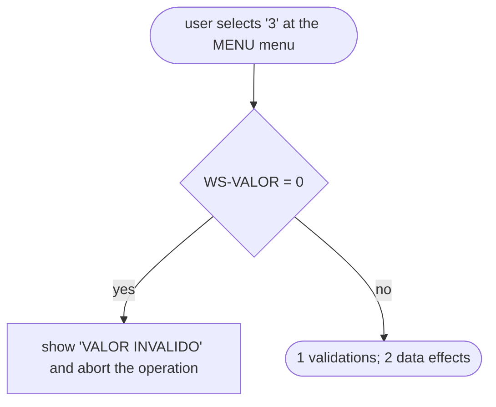
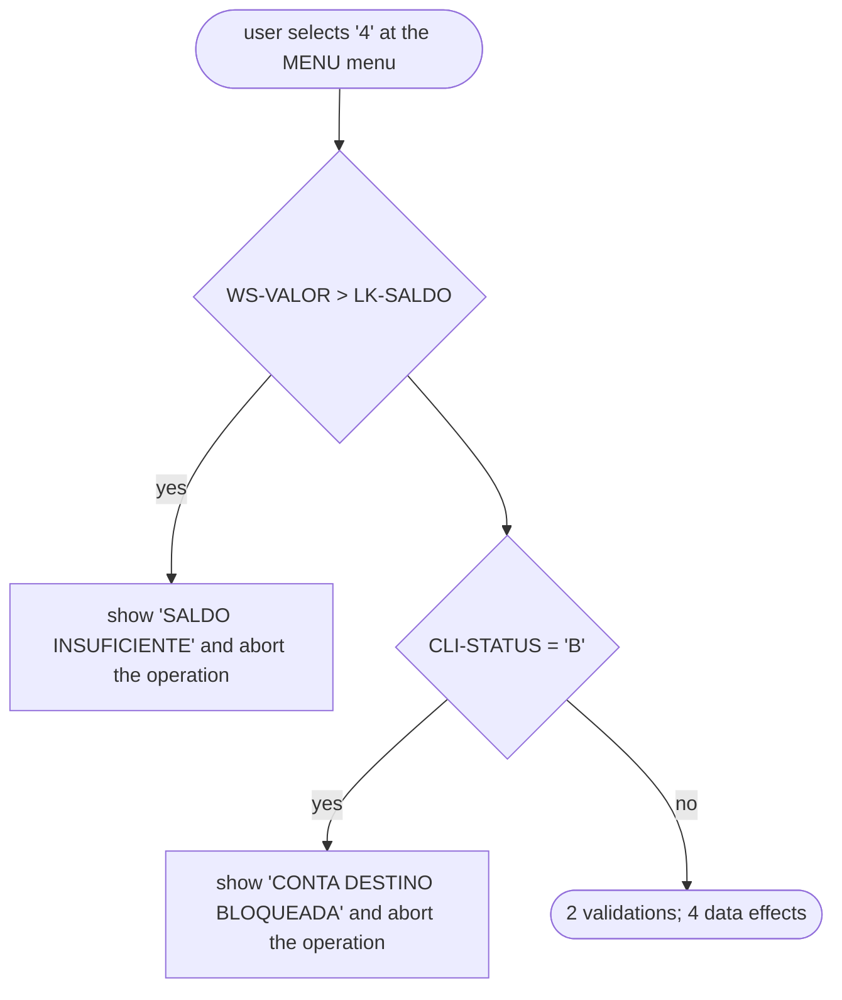
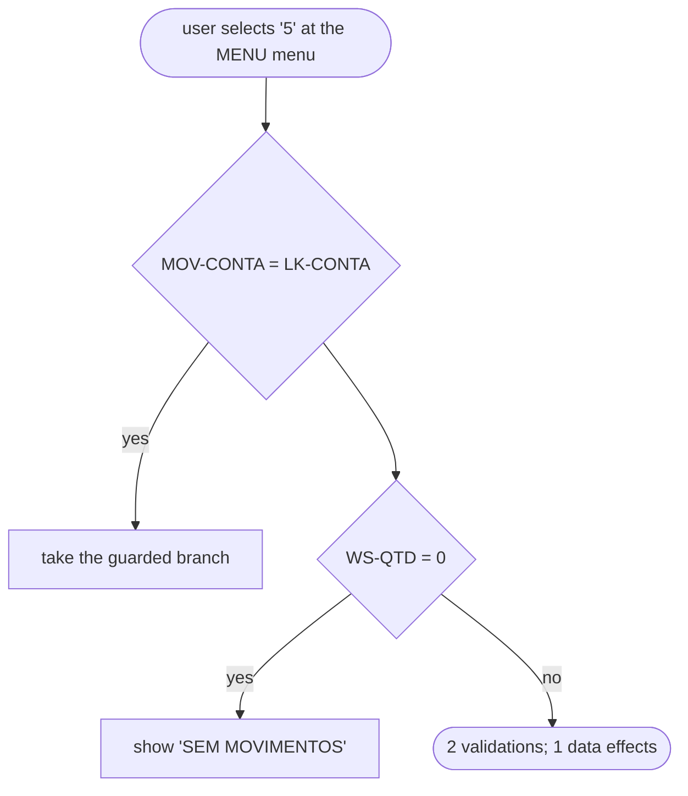

# Operational processes

_For the business orientation (what the system is, who uses it, what it manages, its rules and parameters) read `business-context.md` first._

## Overview

The system is operated from MENU, __MAIN__, TEST_PIPELINE. A user can perform 7 operation(s): MENU start-up (login / session setup); Option '1': SALDO; Option '2': SAQUE; Option '3': DEPOSITO; Option '4': TRANSFERENCIA; Option '5': EXTRATO; Option '9': Set WS-FIM to 'S'. Across these operations the code applies 11 validation check(s) and makes 7 write(s) to stored data in: CLI-REG, CLIENTES, MOV-REG, MOVTOS. Process names below are taken from the code's own labels; their business meaning (what a routine called SAQUE is *for*) is a reading of the code, not something the code states. Each step in the tables cites the line it comes from.

## Process summary

| Process | Trigger | Checks | Data changes | Confidence |
|---|---|---|---|---|
| MENU start-up (login / session setup) | MENU is executed | 3 | 0 | inferred |
| Option '1': SALDO | user selects '1' at the MENU menu | 0 | 0 | confirmed |
| Option '2': SAQUE | user selects '2' at the MENU menu | 3 | 2 | confirmed |
| Option '3': DEPOSITO | user selects '3' at the MENU menu | 1 | 2 | confirmed |
| Option '4': TRANSFERENCIA | user selects '4' at the MENU menu | 2 | 3 | confirmed |
| Option '5': EXTRATO | user selects '5' at the MENU menu | 2 | 0 | confirmed |
| Option '9': Set WS-FIM to 'S' | user selects '9' at the MENU menu | 0 | 0 | confirmed |

## Processes in detail
Each process has a plain-English description followed by the exact steps. Each step cites the line it comes from; decisions show both outcomes. The *steps* are confirmed; the *names and descriptions* interpret them.

## 🟡 MENU start-up (login / session setup)

- Technical: `MAIN`  
- Trigger: MENU is executed  
- Actor: user  
- Outcome: session established or aborted

**Description.** This process starts when MENU is executed. The system prompts "CONTA:" and reads conta (WS-CONTA). It reads a CLIENTES record. It may show the message "CONTA INVALIDA". If status (CLI-STATUS) equals 'B', the system shows the message "CONTA BLOQUEADA". MENU calls KBDREAD. If senha (WS-SENHA) is not senha (CLI-SENHA), the system shows the message "SENHA INVALIDA". If tentativas (WS-TENTATIVAS) is at least 3, the system shows the message "CARTAO BLOQUEADO" and the operation stops. In total the process applies 3 check(s) and makes 0 change(s) to stored data.

**Steps.**

| # | Unit | Step | If true | If false | Evidence |
|---|---|---|---|---|---|
| 1 | MENU | ⌨️ Take input WS-CONTA (prompt "CONTA:") |  |  | `examples/legacy_atm/MENU.cbl:43` |
| 2 | MENU | 💾 READ CLIENTES |  |  | `examples/legacy_atm/MENU.cbl:45` |
| 3 | MENU | ⚠️ Show "CONTA INVALIDA" |  |  | `examples/legacy_atm/MENU.cbl:47` |
| 4 | MENU | ❓ Check `CLI-STATUS = 'B'` | show "CONTA BLOQUEADA" | continue | `examples/legacy_atm/MENU.cbl:50-51` |
| 5 | MENU | → Call KBDREAD |  |  | `examples/legacy_atm/MENU.cbl:56` |
| 6 | MENU | ❓ Check `WS-SENHA NOT = CLI-SENHA` | show "SENHA INVALIDA" | continue | `examples/legacy_atm/MENU.cbl:57-59` |
| 7 | MENU | ❓ Check `WS-TENTATIVAS >= 3` | show "CARTAO BLOQUEADO" and abort the operation | continue | `examples/legacy_atm/MENU.cbl:31` |

## ✅ Option '1': SALDO

- Technical: `WS-OPCAO WHEN '1' → SALDO`  
- Trigger: user selects '1' at the MENU menu  
- Actor: user  
- Outcome: 0 validations; 0 data effects

**Description.** This process starts when user selects '1' at the MENU menu. MENU hands over to CONTA with operation code 'S', which runs its SALDO routine. CONTA hands over to UTIL with operation code 'F', which runs its FORMATA routine. In total the process applies 0 check(s) and makes 0 change(s) to stored data.

**Steps.**

| # | Unit | Step | If true | If false | Evidence |
|---|---|---|---|---|---|
| 1 | MENU | → Call CONTA with operation 'S' |  |  | `examples/legacy_atm/MENU.cbl:67` |
| 2 | CONTA | → CONTA dispatches 'S' to SALDO |  |  | `examples/legacy_atm/CONTA.cbl:47-48` |
| 3 | CONTA | → Call UTIL with operation 'F' |  |  | `examples/legacy_atm/CONTA.cbl:59` |
| 4 | UTIL | → UTIL dispatches 'F' to FORMATA |  |  | `examples/legacy_atm/UTIL.cbl:14-15` |

## ✅ Option '2': SAQUE

- Technical: `WS-OPCAO WHEN '2' → SAQUE`  
- Trigger: user selects '2' at the MENU menu  
- Actor: user  
- Outcome: 3 validations; 2 data effects

**Description.** This process starts when user selects '2' at the MENU menu. MENU hands over to CONTA with operation code 'Q', which runs its SAQUE routine. The system prompts "VALOR DO SAQUE:" and reads valor (WS-VALOR). If valor (WS-VALOR) is greater than limite saque (WS-LIMITE-SAQUE), the system shows the message "LIMITE DE SAQUE EXCEDIDO" and the operation stops. If valor (WS-VALOR) is greater than saldo (LK-SALDO), the system shows the message "SALDO INSUFICIENTE" and the operation stops. If the remainder of valor (WS-VALOR) divided by 10 is not 0, the system shows the message "VALOR DEVE SER MULTIPLO DE 10" and the operation stops. It then runs the GRAVA routine. It updates the existing CLI-REG record. It writes a new MOV-REG record. In total the process applies 3 check(s) and makes 2 change(s) to stored data.

**Steps.**

| # | Unit | Step | If true | If false | Evidence |
|---|---|---|---|---|---|
| 1 | MENU | → Call CONTA with operation 'Q' |  |  | `examples/legacy_atm/MENU.cbl:69` |
| 2 | CONTA | → CONTA dispatches 'Q' to SAQUE |  |  | `examples/legacy_atm/CONTA.cbl:49-50` |
| 3 | CONTA | ⌨️ Take input WS-VALOR (prompt "VALOR DO SAQUE:") |  |  | `examples/legacy_atm/CONTA.cbl:63` |
| 4 | CONTA | ❓ Check `WS-VALOR > WS-LIMITE-SAQUE` | show "LIMITE DE SAQUE EXCEDIDO" and abort the operation | continue | `examples/legacy_atm/CONTA.cbl:64-65` |
| 5 | CONTA | ❓ Check `WS-VALOR > LK-SALDO` | show "SALDO INSUFICIENTE" and abort the operation | continue | `examples/legacy_atm/CONTA.cbl:68-69` |
| 6 | CONTA | ❓ Check `FUNCTION MOD(WS-VALOR, 10) NOT = 0` | show "VALOR DEVE SER MULTIPLO DE 10" and abort the operation | continue | `examples/legacy_atm/CONTA.cbl:72-73` |
| 7 | CONTA | → Perform GRAVA |  |  | `examples/legacy_atm/CONTA.cbl:78` |
| 8 | CONTA | 💾 REWRITE CLI-REG |  |  | `examples/legacy_atm/CONTA.cbl:117` |
| 9 | CONTA | 💾 WRITE MOV-REG |  |  | `examples/legacy_atm/CONTA.cbl:121` |

## ✅ Option '3': DEPOSITO

- Technical: `WS-OPCAO WHEN '3' → DEPOSITO`  
- Trigger: user selects '3' at the MENU menu  
- Actor: user  
- Outcome: 1 validations; 2 data effects

**Description.** This process starts when user selects '3' at the MENU menu. MENU hands over to CONTA with operation code 'D', which runs its DEPOSITO routine. The system prompts "VALOR DO DEPOSITO:" and reads valor (WS-VALOR). If valor (WS-VALOR) equals 0, the system shows the message "VALOR INVALIDO" and the operation stops. It then runs the GRAVA routine. It updates the existing CLI-REG record. It writes a new MOV-REG record. In total the process applies 1 check(s) and makes 2 change(s) to stored data.

**Steps.**

| # | Unit | Step | If true | If false | Evidence |
|---|---|---|---|---|---|
| 1 | MENU | → Call CONTA with operation 'D' |  |  | `examples/legacy_atm/MENU.cbl:71` |
| 2 | CONTA | → CONTA dispatches 'D' to DEPOSITO |  |  | `examples/legacy_atm/CONTA.cbl:51-52` |
| 3 | CONTA | ⌨️ Take input WS-VALOR (prompt "VALOR DO DEPOSITO:") |  |  | `examples/legacy_atm/CONTA.cbl:81` |
| 4 | CONTA | ❓ Check `WS-VALOR = 0` | show "VALOR INVALIDO" and abort the operation | continue | `examples/legacy_atm/CONTA.cbl:82-83` |
| 5 | CONTA | → Perform GRAVA |  |  | `examples/legacy_atm/CONTA.cbl:88` |
| 6 | CONTA | 💾 REWRITE CLI-REG |  |  | `examples/legacy_atm/CONTA.cbl:117` |
| 7 | CONTA | 💾 WRITE MOV-REG |  |  | `examples/legacy_atm/CONTA.cbl:121` |

## ✅ Option '4': TRANSFERENCIA

- Technical: `WS-OPCAO WHEN '4' → TRANSFERENCIA`  
- Trigger: user selects '4' at the MENU menu  
- Actor: user  
- Outcome: 2 validations; 4 data effects

**Description.** This process starts when user selects '4' at the MENU menu. MENU hands over to CONTA with operation code 'T', which runs its TRANSFERENCIA routine. The system prompts "CONTA DESTINO:" and reads destino (WS-DESTINO). The system prompts "VALOR:" and reads valor (WS-VALOR). If valor (WS-VALOR) is greater than saldo (LK-SALDO), the system shows the message "SALDO INSUFICIENTE" and the operation stops. It reads a CLIENTES record. It may show the message "CONTA DESTINO INEXISTENTE". If status (CLI-STATUS) equals 'B', the system shows the message "CONTA DESTINO BLOQUEADA" and the operation stops. It updates the existing CLI-REG record. It then runs the GRAVA routine. It updates the existing CLI-REG record. It writes a new MOV-REG record. In total the process applies 2 check(s) and makes 3 change(s) to stored data.

**Steps.**

| # | Unit | Step | If true | If false | Evidence |
|---|---|---|---|---|---|
| 1 | MENU | → Call CONTA with operation 'T' |  |  | `examples/legacy_atm/MENU.cbl:73` |
| 2 | CONTA | → CONTA dispatches 'T' to TRANSFERENCIA |  |  | `examples/legacy_atm/CONTA.cbl:53-54` |
| 3 | CONTA | ⌨️ Take input WS-DESTINO (prompt "CONTA DESTINO:") |  |  | `examples/legacy_atm/CONTA.cbl:91` |
| 4 | CONTA | ⌨️ Take input WS-VALOR (prompt "VALOR:") |  |  | `examples/legacy_atm/CONTA.cbl:93` |
| 5 | CONTA | ❓ Check `WS-VALOR > LK-SALDO` | show "SALDO INSUFICIENTE" and abort the operation | continue | `examples/legacy_atm/CONTA.cbl:95-96` |
| 6 | CONTA | 💾 READ CLIENTES |  |  | `examples/legacy_atm/CONTA.cbl:100` |
| 7 | CONTA | ⚠️ Show "CONTA DESTINO INEXISTENTE" |  |  | `examples/legacy_atm/CONTA.cbl:102` |
| 8 | CONTA | ❓ Check `CLI-STATUS = 'B'` | show "CONTA DESTINO BLOQUEADA" and abort the operation | continue | `examples/legacy_atm/CONTA.cbl:105-106` |
| 9 | CONTA | 💾 REWRITE CLI-REG |  |  | `examples/legacy_atm/CONTA.cbl:111` |
| 10 | CONTA | → Perform GRAVA |  |  | `examples/legacy_atm/CONTA.cbl:114` |
| 11 | CONTA | 💾 REWRITE CLI-REG |  |  | `examples/legacy_atm/CONTA.cbl:117` |
| 12 | CONTA | 💾 WRITE MOV-REG |  |  | `examples/legacy_atm/CONTA.cbl:121` |

## ✅ Option '5': EXTRATO

- Technical: `WS-OPCAO WHEN '5' → EXTRATO`  
- Trigger: user selects '5' at the MENU menu  
- Actor: user  
- Outcome: 2 validations; 1 data effects

**Description.** This process starts when user selects '5' at the MENU menu. MENU calls EXTRATO. It displays "--- EXTRATO ---". It reads a MOVTOS record. It then runs the MOSTRA routine. If conta (MOV-CONTA) equals conta (LK-CONTA), it take the guarded branch; otherwise it continues. EXTRATO hands over to UTIL with operation code 'F', which runs its FORMATA routine. It displays "MOV-TIPO". If WS-QTD equals 0, the system shows the message "SEM MOVIMENTOS". In total the process applies 2 check(s) and makes 0 change(s) to stored data.

**Steps.**

| # | Unit | Step | If true | If false | Evidence |
|---|---|---|---|---|---|
| 1 | MENU | → Call EXTRATO |  |  | `examples/legacy_atm/MENU.cbl:75` |
| 2 | EXTRATO | 🖥️ Display "--- EXTRATO ---" |  |  | `examples/legacy_atm/EXTRATO.cbl:27` |
| 3 | EXTRATO | 💾 READ MOVTOS |  |  | `examples/legacy_atm/EXTRATO.cbl:29` |
| 4 | EXTRATO | → Perform MOSTRA |  |  | `examples/legacy_atm/EXTRATO.cbl:31` |
| 5 | EXTRATO | ❓ Check `MOV-CONTA = LK-CONTA` | take the guarded branch | continue | `examples/legacy_atm/EXTRATO.cbl:40` |
| 6 | EXTRATO | → Call UTIL with operation 'F' |  |  | `examples/legacy_atm/EXTRATO.cbl:42` |
| 7 | UTIL | → UTIL dispatches 'F' to FORMATA |  |  | `examples/legacy_atm/UTIL.cbl:14-15` |
| 8 | EXTRATO | 🖥️ Display "MOV-TIPO" |  |  | `examples/legacy_atm/EXTRATO.cbl:43` |
| 9 | EXTRATO | ❓ Check `WS-QTD = 0` | show "SEM MOVIMENTOS" | continue | `examples/legacy_atm/EXTRATO.cbl:34-35` |

## ✅ Option '9': Set WS-FIM to 'S'

- Technical: `WS-OPCAO WHEN '9' → Set WS-FIM to 'S'`  
- Trigger: user selects '9' at the MENU menu  
- Actor: user  
- Outcome: 0 validations; 0 data effects

**Description.** This process starts when user selects '9' at the MENU menu. It set WS-FIM to 'S'. In total the process applies 0 check(s) and makes 0 change(s) to stored data.

**Steps.**

| # | Unit | Step | If true | If false | Evidence |
|---|---|---|---|---|---|
| 1 | MENU | 🖥️ Set WS-FIM to 'S' |  |  | `examples/legacy_atm/MENU.cbl:77` |
