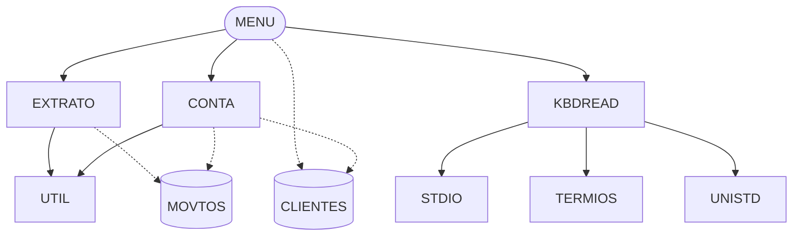

# Architecture

The system has 5 units; entry point(s): MENU. 8 call/import edges and 2 data stores were recovered. Layering below is inferred from fan-in and entry points.

## Component and data-store graph

## Layers (inferred)

- **Entry / UI**: MENU
- **Shared services**: UTIL
- **Domain modules**: CONTA, EXTRATO, KBDREAD

## Main flows

- **Fan-out from MENU (call targets, not a sequence)**: CONTA → EXTRATO → KBDREAD

## Architecture claims

- 🟡 **C-071** UTIL is a shared utility: 2 units depend on it, so changes to it have system-wide impact.
- 🟡 **C-072** Data store 'CLIENTES' is shared by CONTA, MENU; they are coupled through the file layout, not through calls.
- 🟡 **C-073** Data store 'MOVTOS' is shared by CONTA, EXTRATO; they are coupled through the file layout, not through calls.
